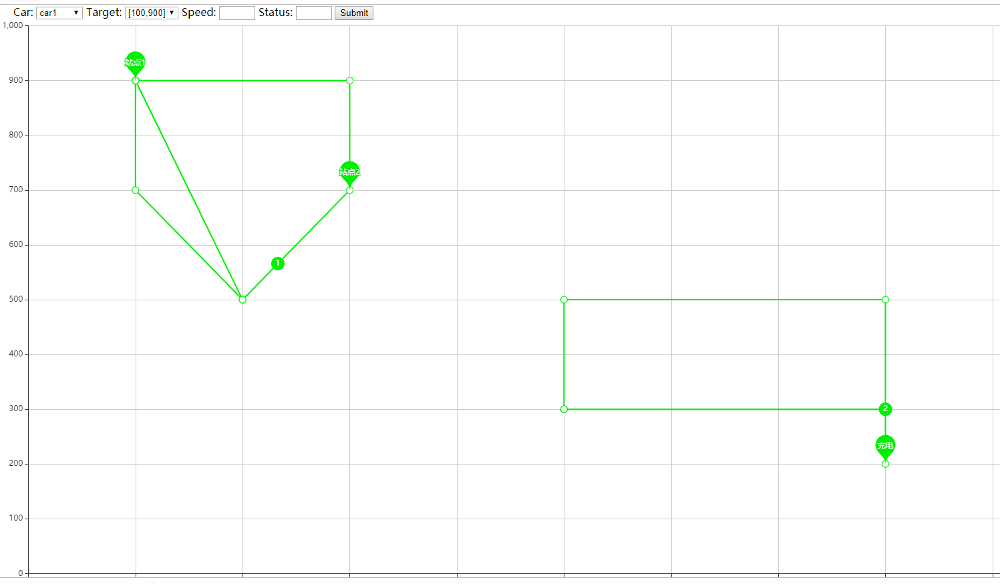

# agv-simulation
###使用介绍   
1.启动redis服务器    
2.启动flask  
3.lib/car.py文件启动多辆小车   
4.打开agv-simulator.html    

###功能介绍    
1.路径：1.自动计算原点--终点最短路径行走；2.人为指定行走路径上的各个节点-appoint    
2.mode：normal:按路径行走一次；loop：按路径走完一遍后原路返回，重复如此；circle:按路径走到终点后，不断重复走相同路径    
3.改变速度    

### 效果图  

### 项目介绍：  
使用web项目模拟智能小车运动轨迹，页面展现运动轨迹，支持设置运动参数    
1.websocket保持前后台通信，后台数据实时更新到前台       
2.redis消息队列：各小车实时位置，状态，速度信息上传    

### 程序流程：    
1.初始化小车：   
2.执行run    
2.1计算路径（寻找最近的站点2个（或1个），计算站点分别到目标站点的路径规划    
2.2选取路径最优点方案
2.2执行路径（每秒更新当前位置并更新到redis）)    
3.nextpoint切换：    
3.1判断是否到达当前的Nextpoint    
3.2已到达则 del(self.willpath[0])
3.3计算接下来的路径

### 小车最短路径算法：    
1.找到小车当前邻点    
2.计算几个邻点到目标点的最短路径    
3.几个邻点路径+小车到邻点路径，取最小值   
4.计算path

### 事件：    
1.指定到目标点    
2.模拟故障（停止在本地）    
3.运行过程中改变目标点    
4.在非site点时开始规划路径    
5.target为非site点    
6.运行过程中改变小车速度   
7.小车运行在两点直线旁边   
8.    

### 数据传输：    
redis数据暂存格式：    
key  value  
car1_20191031-101005 {'position':'[200,500]','speed':'10'} #上传位置信息
消息队列传输小车实时信息：    
{'name':'car1','target':'[300,900]','status':'normal','id':'ax001'}    

## 技术实现：  
1.前端：jquery+echarts  
2.后端：falsk框架+websockets
3.redis消息队列使用
